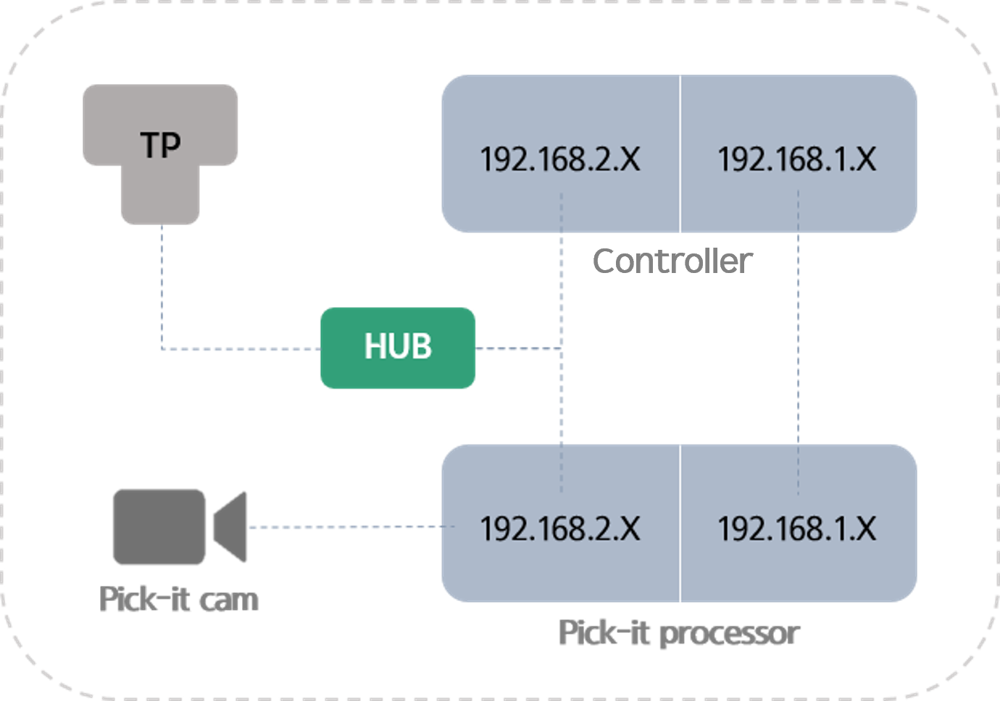

## 1.1 하드웨어 구성

플러그인 동작에 필요한 주요 부품은 다음과 같습니다.  
`${cont_model} COM`, `${cont_model} TP`, `pick-it 프로세서`, `pick-it 카메라`,`허브` 또는 `라우터`  

<br>


1. 192.168.2.XX 대역으로 연결하는 경우
   - 192.168.2 대역은, TP 와 COM 통신에 활용되므로 플러그인에서 2대역을 통해 이미지를 받아올 수 없습니다.
   - 그럼에도 불구하고 2대역을 활용해야만 하는 경우, 허브를 활용하여 아래와 같이 네트워크를 구성하는 경우, 2대역을 통해 이미지를 받아올 수 있습니다.
   - HW 구성도<br>
   

<br>

2. 그 외 대역의 경우
   - ${cont_model} COM 의 범용 LAN 포트를 활용하여 연결할 수 있습니다.
   - 예제) 영상 서버 호스트 주소가 192.168.1.100 이고, 통신 포트가 8070 인 경우
     1. 영상 서버의 게이트웨이 설정
        - 스트리밍을 하는 영상 서버의 게이트웨이를 연결하고자하는 제어기 ip 와 일치시킵니다.  
        ex) LAN1 에 연결하는 경우, 영상 서버의 게이트웨이 설정은 192.168.1.150 이어야합니다.

            <div style="border:3px solid #0B57D0; background:#E9F2FF; color:#0B2E57; padding:1px 3px; border-radius:10px; max-width:fit-content; rgba(0,0,0,.08);">
            <span>Windows 10 에서 설정하는 경우</span>
            <ol style="margin:0; padding-left:25px; line-height:1.8; font-size:14px;">
                <li>시작 → 네트워크 연결 보기</li>
                <li>연결된 이더넷 우클릭 → 속성</li>
                <li>인터넷 프로토콜 버전4 (TCP/IPv4) 선택 → 속성</li>
                <li>다음 IP 주소 사용(S) 선택</li>
                <li>IP 주소 / 서브넷 마스크 / 게이트웨이 입력</li>
            </ol>
            </div>


     2. TP 의 네트워크 설정

        - TP > 관리자 모드 진입(R314) > 서비스 > 13: 티치펜던트 네트워크 > 동의 여부 확인 > 하기 내용으로 설정 진행

            <div style="border:2px solid red; background-color:#ffecec; color:#d8000c; padding:12px; font-weight:bold; font-size:14px; border-radius:6px;max-width:fit-content;">
            [주의] 하기 옵션 외 다른 설정을 선택하면 TP의 IP 주소가 변경되어 
            제어기 간 통신이 불능 상태에 빠집니다. 현장에서 원상 복구가 매우 어렵기 때문에 
            <strong>반드시 아래 지침과 동일하게 설정을 진행해야 합니다.</strong>
            </div><br>

            - IP: 192.168.2.77
            - 서브넷마스트: 24
            - 게이트웨이: 192.168.2.150

        - 제어기 재부팅 진행
     3. 플러그인 쪽 url 수정

        - pickit 폴더 > ui 폴더 > js 폴더 > display.js 에서 요청하는 영상 스트리밍 서비스 url 수정
            <div style="border:1px solid #ccc; background-color:#f9f9f9; color:#333; padding:6px 10px; border-radius:4px; max-width:fit-content; font-size:13px; line-height:1.5;">
            현재 <strong>사전 협의</strong>를 통해 사용 허가를 받은 고객에 대해서만 플러그인을 제공하고 있습니다.<br>
            문의 : HD현대로보틱스 이동형 연구원 (<a href="mailto:donghyeong.lee@hd.com">donghyeong.lee@hd.com</a>)
            </div><br>

            <div style="max-width:fit-content;">

            ```python 
            # host ip: 192.168.1.100, port: 8070 이고 서비스에 맞게 쿼리 구성
            var url = "http://192.168.1.100:8070/stream?topic=/pickit/viewer/image_out"
            ```
            </div>
     4. 플러그인 설치
        - [설치 페이지](../2-sw_install/README.md)를 참조하여 3에서 수정한 플러그인을 제어기에 설치
