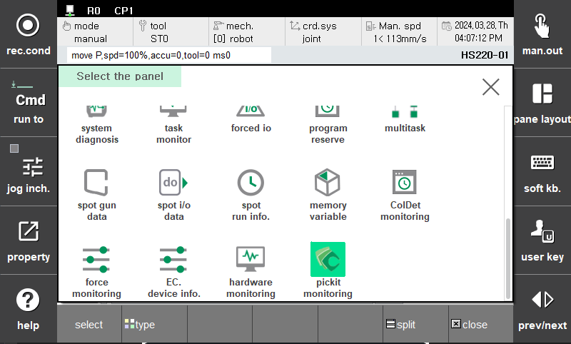

# 1. 미리보기

다음 사진들은 픽잇 플러그인을 실행할 때 볼 수 있는 대표적인 2가지 UI 입니다.  
하기 UI 미리보기를 통해 실제 플러그인이 동작하는 과정을 확인할 수 있습니다.

 

## 1.1 창 분할 모니터링 화면

기존 TP UI 기능과 호환되므로, 창 분할 화면, 확대 기능 등을 활용할 수 있습니다.  
pick-it 로봇 언어 함수 동작에 따른 결과를 실시간으로 창 분할 화면을 통해 확인할 수 있습니다.  
`Request to Pickit` 창에서는 pick-it 프로세서에 요청되는 명령어와 특성 값이 확인됩니다.  
`Response from Pickit` 창에서는 돌아오는 응답 상태와 추가 정보들이 확인됩니다.  

창 분할 방법은 다음과 같습니다.  
- `창조정` 클릭 > `분할` 클릭 > 우측 분할 창 클릭 > `창조정` 클릭 > `선택` 클릭 > 스크롤 후 `픽잇 모니터링` 더블 클릭  

분할된 창을 확대하는 방법은 다음과 같습니다.  
- `픽잇 모니터링 창`이 활성화(클릭된 상태)가 된 것을 확인 > `shift + esc` 버튼 클릭  

동일한 동작을 반복하면 확대된 창이 축소 됩니다.  

  

`Fig a` 패널 선택 메뉴 화면

  

`Fig b` 창 분할 시 출력되는 화면

  

`Fig c` 분할된 화면을 확대했을 때의 화면

 

## 1.2 설정 화면  

설정화면에서는 다음 추가 작업들을 할 수 있습니다.  
1. 픽잇 프로세서 연결에 사용된 `ip` 와 `port`를 입력하고 연결 시 소켓 `타임아웃` 값을 입력 및 변경할 수 있습니다.
2. `Reconnect` 버튼을 통해, 연결이 끊겼거나, `ip`, `port`가 변경됐을 때 재연결을 할 수 있습니다.
3. `1.1 창 분할 모니터링 화면` 에서 확인되는 수치들을 동일하게 확인할 수 있습니다.
4. `확인` 버튼을 통해 현재 `ip`, `port` 정보를 제어기에 저장합니다.

  

`Fig d` 설정 화면 UI
