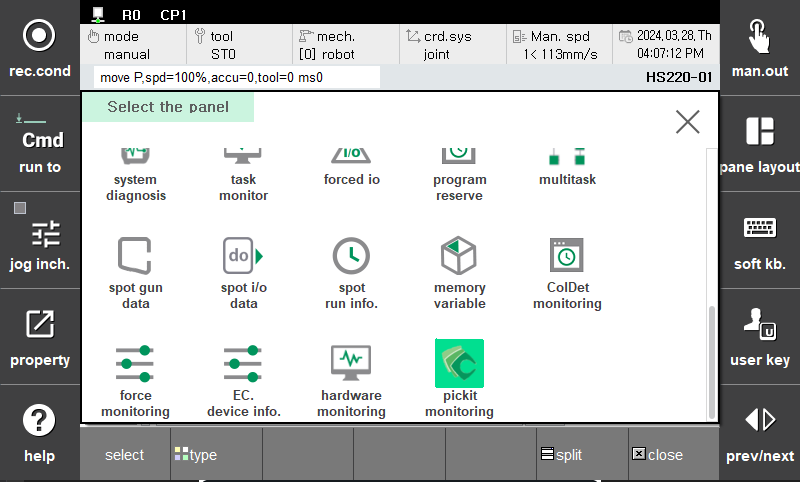

## 2.1 监控面板

它与现有的TP UI功能兼容，因此您可以利用窗口分屏、缩放功能等。  
您可以通过监控面板实时检查pick-it机器人语言功能操作的结果。  
在`Request to Pickit`字段中确认Pickit处理器请求的命令和属性值。  
在`Response from Pickit`字段中，您可以检查响应状态和附加信息。

以下是如何分割窗口：  
- `窗格布局 (pane layout)` > `分割 (split)` > 点击右侧的分割面板。 > `窗格布局 (pane layout)` > `选择 (select)` > 向下滚动并点击`pickit monitoring`。

以下是如何缩放监控面板：  
- 点击`pickit monitoring panel` > 点击`shift + esc`  

重复相同的操作将缩小缩放的窗口。  

`Fig a` 选择pick-it监控面板



长时间进行实时视频流传输时，由于 TP 的 CPU 负载较高，可能会导致流传输速度下降等问题。



`Fig b` pick-it监控面板

`Fig c` 放大的监控面板
