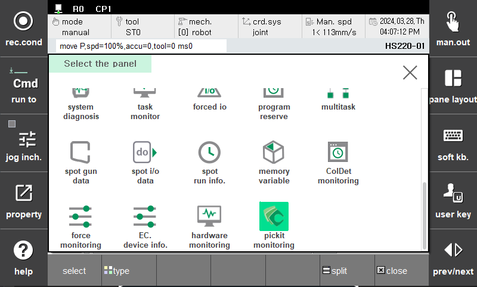
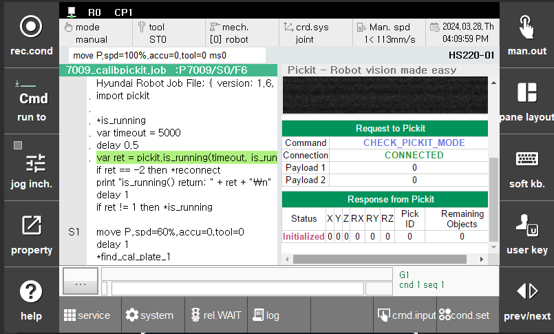

## 2.1 Monitoring Panel

It is compatible with existing TP UI features, so you can utilize window split screen, zoom functions, etc.  
You can check the results of the pick-it robot language function operation in real time through the monitoring panel.  
In the `Request to Pickit`  field confirms the command and attribute values requested by the Pickit processor.  
In the `Response from Pickit` field, you can check the status of the response and additional information.

Here's how to split a window:  
- `pane layout` > `split` > Click on the split panel on the right. > `pane layout` > `select` > Scroll down and click on `pickit monitoring`.

Here's how to zoom a monitoring panel:  
- Click the `pickit monitoring panel` > Click `shift + esc`  

Repeating the same operation will shrink the zoomed window.  

`Fig a` Selecting pick-it monitoring panel

`Fig b` pick-it monitoring panel

`Fig c` zoomed monitoring panel