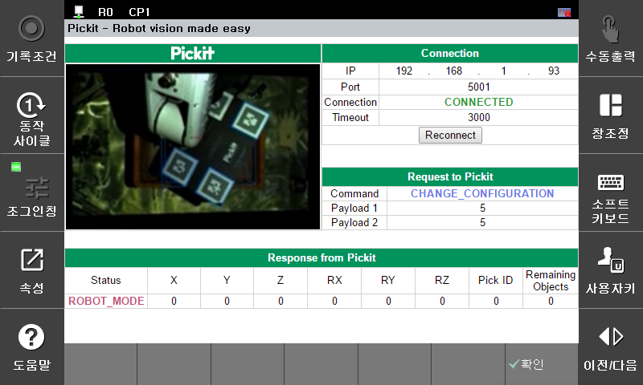

## 2.2 Setup Window

The procedure to enter the plugin settings screen is as follows.

- `System` > `4: Application parameter` > `25: pickit` > 

  

`Fig d` Setup UI

You can perform the following additional tasks on the settings screen:  
1. You can enter the `ip` and `port` used when connecting to the pick-it processor, and enter and change the socket `timeout` value when connecting.  
2. The `Reconnect` button allows you to reconnect if the connection is lost or the `ip` or `port` has changed.
3. You can check the same values as seen in `2.1 Monitoring Panel`.
4. Click the `OK` button to save the current `ip` and `port` information to the controller.