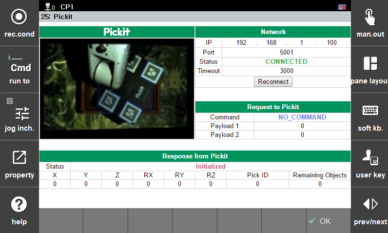

## 2.2 设置窗口



在长时间流式传输实时视频时，由于TP的高CPU负载，流媒体速度可能会下降，并可能出现其他问题。



进入插件设置屏幕的程序如下。

- `[F2: 系统] - 4: 应用参数 - 25: pickit ([F2: System] - 4: Application parameter - 25: pickit)`

  

`Fig d` 设置 UI

您可以在设置屏幕上执行以下附加任务：  
1. 您可以输入连接到pick-it处理器时使用的`ip`和`port`，并在连接时输入和更改socket `timeout`值。  
2. `Reconnect`按钮允许您在连接丢失或`ip`或`port`发生改变时重新连接。
3. 您可以检查与`2.1 监控面板`中看到的相同值。
4. 点击`确定 (OK)`按钮将当前的`ip`和`port`信息保存到控制器中。