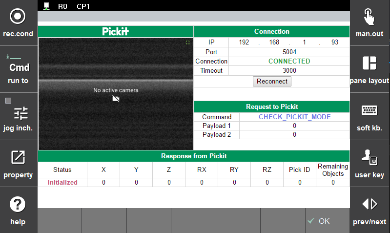

## 2.2 설정 화면  

  

`Fig d` 설정 화면 UI

설정화면에서는 다음 추가 작업들을 할 수 있습니다.  
1. pick-it 프로세서 연결에 사용된 `ip` 와 `port`를 입력하고 연결 시 소켓 `타임아웃` 값을 입력 및 변경할 수 있습니다.
2. `Reconnect` 버튼을 통해, 연결이 끊겼거나, `ip`, `port`가 변경됐을 때 재연결을 할 수 있습니다.
3. `1.1 창 분할 모니터링 화면` 에서 확인되는 수치들을 동일하게 확인할 수 있습니다.
4. `확인` 버튼을 통해 현재 `ip`, `port` 정보를 제어기에 저장합니다.  