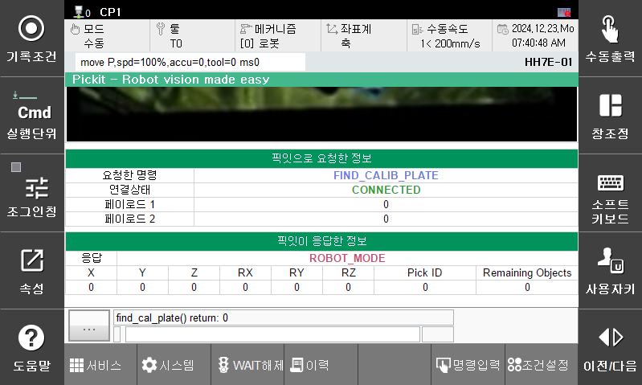

## 3.1. pick-it 프로세서에서 사용되는 상수

현재 페이지는 pick-it 프로세서에 요청하는 명령어와 응답 내용에 대한 것입니다.  
자세한 내용은 [pick-it 공식 문서](https://docs.pickit3d.com/en/latest/robots/robot-brands/socket_communication.html#pickit-socket-interface)를 참조하십시오.  

 

`Fig a` 모니터링 용 창분할 화면을 확대한 경우

 

|속성|방향|내용|
|:---|:---|:---|
|`요청한 명령`|Hi6 com &rightarrow; pick-it processor|요청 명령어를 나타냅니다. |
|`연결상태`|Hi6 com &leftrightarrow; pick-it processor|Hi6 com 과 pick-it processor 의 통신 연결 상태를 나타냅니다. |
|`페이로드 1`, `페이로드 2`|Hi6 com &leftarrow; pick-it processor| 요청시 전달하는 [pickit 명령 요청 인자.](https://docs.pickit3d.com/en/latest/robots/robot-brands/socket_communication.html#response-message) |
|`응답`|Hi6 com &leftarrow; pick-it processor| 요청에 대한 응답을 나타냅니다. |
|`X,Y,Z,RX,RY,RZ`|Hi6 com &leftarrow; pick-it processor| pick-it processor 가 판단한 사물의 위치 정보를 나타냅니다. |
|`Pick ID`|Hi6 com &leftarrow; pick-it processor| 피킹 대상이 되는 사물의 식별자를 나타냅니다. |  
|`Remaining Object`|Hi6 com &leftarrow; pick-it processor| 0이 아닌 경우 검색 가능한 나머지 개체 수가 포함됩니다. |  

  

### 3.1.1 pick-it 명령어 상수

다음은 pick-it 프로세서에 요청 시 사용되는 명령어 상수들입니다.  
`픽잇으로 요청한 정보`의 `요청한 명령`에 표시되는 명령어들입니다.  
자세한 내용은 [pick-it 공식 문서](https://docs.pickit3d.com/en/latest/robots/robot-brands/socket_communication.html#response-status)를 참조하십시오. 

|명령어|값|
|:---|:---|
|`NO_COMMAND`|-1|
|`CHECK_MODE`|0|
|`SHUTDOWN_SYSTEM`|2|
|`FIND_CALIB_PLATE`|10|
|`CONFIGURE_CALIB`|11|
|`COMPUTE_CALIB`|12|
|`VALIDATE_CALIB`|13|
|`LOOK_FOR_OBJECTS`|20|
|`LOOK_FOR_OBJECTS_WITH_RETRIES`|21|
|`CAPTURE_IMAGE`|22|
|`PROCESS_IMAGE`|23|
|`NEXT_OBJECT`|30|
|`CONFIGURE`|40|
|`SET_CYLINDER_DIM`|41|
|`SAVE_ACTIVE_SETUP`|42|
|`SAVE_ACTIVE_PRODUCT`|43|
|`SAVE_SCENE`|50|
|`BUILD_BACKGROUND`|60|
|`GET_PICK_POINT_DATA`|70|

  

### 3.1.2 pick-it 프로세서 상태 상수

자세한 내용은 [pick-it 공식 문서](https://docs.pickit3d.com/en/latest/robots/robot-brands/socket_communication.html#response-status)를 참조하십시오. 

|pick-it 프로세서 상태|값|
|:---|:---|
|`UNDEFINED`| -1|
|`ROBOT_MODE`|0|
|`CALIBRATION MODE`|1|
|`IDLE`|2|

  

### 3.1.3 pick-it 응답 상수
`픽잇이 응답한 정보`의 `요청한 명령`에 표시되는 명령어들입니다.  
자세한 내용은 [pick-it 공식 문서](https://docs.pickit3d.com/en/latest/robots/robot-brands/socket_communication.html#response-status)를 참조하십시오. 

|응답|값|
|:---|:---|
|`UNKNOWN_COMMAND`|-99|
|`ROBOT_MODE`|0|
|`IDLE_MODE`|1|
|`SHUTDOWN_REQUEST_ACCEPT`|5|
|`SHUTDOWN_REQUEST_REJECTED`|6|
|`FIND_CALIB_PLATE_OK`|10|
|`FIND_CALIB_PLATE_FAILED`|11|
|`CONFIGURE_CALIB_OK`|12|
|`CONFIGURE_CALIB_FAILED`|13|
|`COMPUTE_CALIB_OK`|14|
|`COMPUTE_CALIB_FAILED`|15|
|`VALIDATE_CALIB_OK`|16|
|`VALIDATE_CALIB_FAILED`|17|
|`OBJECTS_FOUND`|20|
|`NO_OBJECTS`|21|
|`NO_IMAGE_CAPTURED`|22|
|`EMPTY_ROI`|23|
|`IMAGE_CAPTURED`|26|
|`INVALID_LICENSE`|27|
|`CONFIG_OK`|40|
|`CONFIG_FAILED`|41|
|`SAVE_SNAPSHOT_OK`|50|
|`SAVE_SNAPSHOT_FAILED`|51|
|`BUILD_BKG_CLOUD_OK`|60|
|`BUILD_BKG_CLOUD_FAILED`|61|
|`GET_PICK_POINT_DATA_OK`|70|
|`GET_PICK_POINT_DATA_FAILED`|71|

