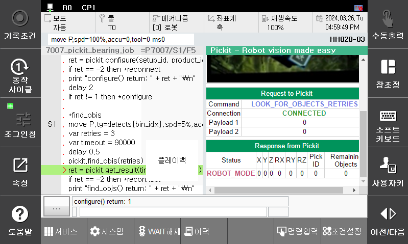
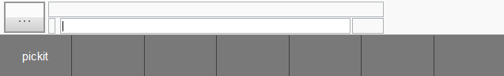
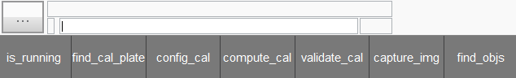
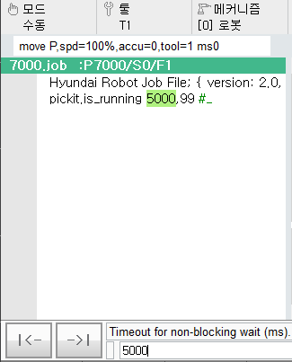

## 3.2. pick-it 로봇 언어 함수

현재 페이지에서는 Hi6 TP 에서 호출되는 pick-it 플러그인 용 job 파일의 함수들을 설명합니다.  
`Fig a` 처럼 job 파일에서 pick-it 플러그인 용 함수들을 동작시키면서 상태 모니터링이 가능합니다.  

 

`Fig a` pick-it 플러그인 용 `get_result()` 함수 호출 중인 장면

 

### 3.2.1 pick-it 로봇 명령어 사용

`Fig a` 화면에서 다음 순서로 클릭 기반의 명령어 입력이 가능합니다.  

1. `명령입력` > `f-버튼` 리스트 확인 > `pickit` 클릭  
 

    `Fig b` pick-it f-버튼 화면

2. 입력하려는 함수 선택  
 

    `Fig c` pick-it 플러그인 용 명령어 리스트 화면

3. 함수 선택 시 등록된 인자 값을 설정할 수 있습니다.  
   

    `Fig d` pick-it 플러그인 용 명령어 호출 화면

 

### 3.2.2 pick-it 로봇 명령어 리스트

로봇 언어 함수는 xhost 기반의 nonblocking 통신 방식이 적용되었습니다.  
하나의 모듈을 통해 통신 요청이 이루어지므로 반환되는 값이 동일합니다.  
각 각의 명령어에 대한 응답 상태는 모니터링 창의 `Status` 칸에서 확인 가능합니다.

| 함수명|&nps&nbsp;&nbsp;&nbsp;&nbsp;&nbsp;&nbsp;&nbsp;&nbsp;&nbsp;&nbsp;&nbsp;&nbsp;&nbsp;&nbsp;&nbsp;&nbsp;&nbsp;&nbsp;&nbsp;&nbsp;&nbsp;&nbsp;&nbsp;&nbsp;&nbsp;&nbsp;&nbsp;&nbsp;&nbsp;&nbsp;&nbsp;&nbsp;&nbsp;&nbsp;&nbsp;&nbsp;&nbsp;&nbsp;&nbsp;&nbsp;&nbsp;&nbsp;&nbsp;&nbsp;&nbsp;&nbsp;&nbsp;&nbsp;&nbsp;&nbsp;&nbsp;&nbsp;&nbsp;&nbsp;&nbsp;&nbsp;&nbsp;&nbsp;&nbsp;&nbsp;&nbsp;&nbsp;&nbsp;&nbsp;&nbsp;&nbsp;&nbsp;&nbsp;&nbsp;&nbsp;&nbsp;&nbsp;&nbsp;&nbsp;&nbsp;&nbsp;&nbsp;&nbsp;&nbsp;&nbsp;&nbsp;&nbsp;&nbsp;&nbsp;&nbsp;&nbsp;&nbsp;&nbsp;&nbsp;&nbsp;&nbsp;&nbsp;&nbsp;&nbsp;&nbsp; 기능| 인자|
|:---|:---|:---|
|`is_running`|픽잇 프로세서에 `CHECK_MODE`명령을 보냅니다. 정상 응답으로 `ROBOT_MODE`를 답합니다. |`1st`) timeout (= 제한시간)  `2nd`) addr_on_timeout (= 타임아웃 시 분기 주소)|
|`find_cal_plate`|픽잇 프로세서에 `FIND_CALIB_PLATE` 명령을 보냅니다.  정상 응답으로 `FIND_CALIB_PLATE_OK`를 답합니다.|`1st`) timeout `2nd`) addr_on_timeout|
|`config_cal`|픽잇 프로세서에 `CONFIGURE_CALIB` 명령을 보냅니다. 정상 응답으로 `CONFIGURE_CALIB_OK`를 답합니다.|`1st`) method(= 캘리브레이션 방법)   &rightarrow; 단일포즈) 0, 다중포즈) 1 `2nd`) camera_mount(= 카메라 위치) &rightarrow; 로봇에 부착) 1, 그 외) 0  `3rd`) timeout `4th`) addr_on_timeout |
|`compute_cal`|픽잇 프로세서에 `COMPUTE_CALIB` 명령을 보냅니다. 정상 응답으로 `COMPUTE_CALIB_OK`를 답합니다.|`1st`) timeout `2nd`) addr_on_timeout|
|`validate_cal`|픽잇 프로세서에 `VALIDATE_CALIB` 명령을 보냅니다. 정상 응답으로 `VALIDATE_CALIB_OK`를 답합니다.|`1st`) timeout `2nd`) addr_on_timeout|
|`capture_img`|픽잇 프로세서에 `CAPTURE_IMAGE` 명령을 보냅니다. 정상 응답으로 `IMAGE_CAPTURED`를 답합니다.|`1st`) timeout `2nd`) addr_on_timeout|
|`find_objs`|아래처럼 픽잇 프로세서에 명령을 보냅니다. retries가 0일 때는 `LOOK_FOR_OBJECTS`를 보내고 0 아닐 때는 `LOOK_FOR_OBJECTS_WITH_RETRIES`을 보냅니다. 정상 응답으로 `IMAGE_CAPTURED`를 답합니다.|`1st`) retries(= 반복 횟수)|
|`process_img`|픽잇 프로세서에 `PROCESS_IMAGE` 명령을 보냅니다.| - |
|`get_next_obj`|픽잇 프로세서에 `NEXT_OBJECT` 명령을 보냅니다.| - |
|`configure`|픽잇 프로세서에 `CONFIGURE` 명령을 보냅니다. 정상 응답으로 `CONFIG_OK`를 답합니다.|`1st`) setup_id(1 ~ 500) `2nd`) Product file No(1 ~ 500) `3rd`) timeout `4th`) addr_on_timeout|
|`get_result`|픽잇 프로세서로부터 `OBJECT_FOUND` 응답을 기다립니다. |`1st`) timeout `2nd`) addr_on_timeout|
|`get_pick_point_data`|픽잇 프로세서에 `GET_PICK_POINT_DATA` 명령을 보냅니다. 정상 응답으로 `GET_PICK_POINT_DATA_OK`를 답합니다.|`1st`) timeout `2nd`) addr_on_timeout|

 

job 파일에서 상기 함수들의 리턴 값을 변수로 반환 받는 경우  
해당 변수의 값의 의미는 다음과 같습니다.

|리턴 값|상태|설명|
|---:|:---:|:---|
|`-1`| `error`| 소켓이 유효하지 않습니다.                 |
|`-2`| `error`| 소켓이 연결되지 않았습니다.               |
|`-3`| `error`| 요청하려는 데이터가 없습니다.             |
|`-4`| `error`| xhost 가 timeout 이 되었습니다.         |
|`-5`| `error`| 응답한 데이터가 파싱하기 적합하지 않습니다. |
|`-6`| `error`| 소켓 recv 에러입니다.                   |
|`-7`| `error`| 데이터를 recv 하는 도중 에러가 발생했습니다.|
|`-8`| `error`| 요청을 시도하다 에러가 발생했습니다.       |
| `0`| - |xhost 모드가 `exec_mode` 이거나 응답을 기다리고 있습니다.|
| `1`| `success`| 실행에 성공하였습니다.|