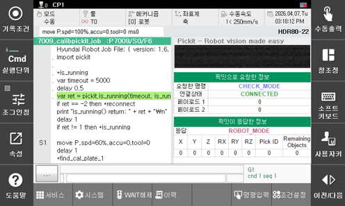
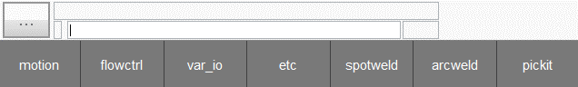
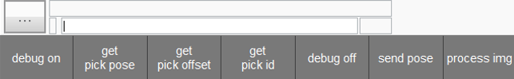
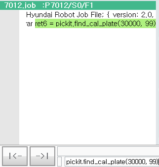
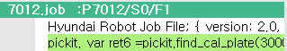
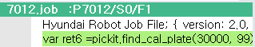

## 3.2. pick-it 로봇 언어 함수

현재 페이지에서는 ${cont_model} TP 에서 호출되는 pick-it 플러그인 용 job 파일의 함수들을 설명합니다.  
`Fig a` 처럼 job 파일에서 pick-it 플러그인 용 함수들을 동작시키면서 상태 모니터링이 가능합니다.  

 

`Fig a` pick-it 플러그인 용 `get_result()` 함수 호출 중인 장면

  

### 3.2.1 pick-it 로봇 명령어 사용

`Fig a` 화면에서 다음 순서로 클릭 기반의 명령어 입력이 가능합니다.  

1. `명령입력` > `f-버튼` 리스트 확인 > `pickit` 클릭  
 

    `Fig b` pick-it f-버튼 화면

2. 입력하려는 함수 선택  
 

    `Fig c` pick-it 플러그인 용 명령어 리스트 화면

3. 함수 선택 시 등록된 인자 값을 설정할 수 있습니다.  
   

    `Fig d` pick-it 플러그인 용 명령어 호출 화면  

4. `pickit. var` 이라는 부분을 `var` 로 수정해서 사용합니다.   
   
수정 후   
    
    - 추후 수정 예정   
   

  

### 3.2.2 pick-it 로봇 명령어 리스트
---- 
#### 1. pick-it 프로세서에 요청하는 명령어 리스트 (= pickit API)
UI 화면의 `픽잇으로 요청한 정보`에서 `요청한 명령` 에 표시가 됩니다.

- #1. `process_img`  
  픽잇 프로세서에 `PROCESS_IMAGE` 명령을 보냅니다.  
  - 인자 값 ) 없음  
  - 반환 값 ) 
  `1`: 송신 성공, `-1`: 보내는 데이터에 문제가 있음, `-2`: 소켓이 연결되지 않음, `-3`: 송신 실패

- #2. `get next object`   
  픽잇 프로세서에 `NEXT_OBJECT` 명령을 보냅니다. `get_result()`를 이어서 호출하여 object 찾기 결과를 받아올 수 있습니다.  
  - 인자 값 ) `timeout`(= 제한시간), `addr_on_timeout`(= 타임아웃 시 분기 주소, ex. 99, error)  
  - 반환 값 ) `1`: 송신 성공, `-1`: 보내는 데이터에 문제가 있음, `-2`: 소켓이 연결되지 않음, `-3`: 송신 실패
  
- #3. `configure`  
  픽잇 프로세서에 `CONFIGURE` 명령을 보냅니다. 정상 응답으로 `40(CONFIG_OK)` 를 답합니다.     
  - 인자 값 ) `setup_id`(1-500), `product_id`(1-500), `timeout`, `addr_on_timeout`  
  - 반환 값 ) `40`: CONFIG_OK, `41`: CONFIG_FAILED, `0`: 응답 대기중, `-2`: 소켓 에러, `-3`: 보낼 데이터가 없음, `-4`: 타임아웃, `-5`: 요청실패

- #4. `is running`
  픽잇 프로세서에 `CHECK_MODE`명령을 보냅니다.  
  - 인자 값 ) `timeout`, `addr_on_timeout`  
  - 반환 값 ) `0`: ROBOT_MODE, `1`: IDLE_MODE, `0`: 응답 대기중, `-2`: 소켓 에러, `-3`: 보낼 데이터가 없음, `-4`: 타임아웃, `-5`: 요청 실패

- #5. `find calib plate`  
  픽잇 프로세서에 `FIND_CALIB_PLATE` 명령을 보냅니다. 정상 응답으로 `10(FIND_CALIB_PLATE_OK)`를 답합니다.  
  - 인자 값 ) `timeout`, `addr_on_timeout`  
  - 반환 값 ) `10`: FIND_CALIB_OK, `11`: FIND_CALIB_FAILED, `0`: 응답 대기중, `-2`: 소켓 에러, `-3`: 보낼 데이터가 없음, `-4`: 타임아웃, `-5`: 요청 실패

- #6. `config calibration`  
  픽잇 프로세서에 `CONFIGURE_CALIB` 명령을 보냅니다. 정상 응답으로 `12(CONFIGURE_CALIB_OK)`를 답합니다.  
  - 인자 값 ) `method`(0: 싱글포즈, 1: 멀티포즈), `camera_mount`(1:로봇에 부착, 0: 그 외),`timeout`, `addr_on_timeout`  
  - 반환 값 ) `12`: CONFIGURE_CALIB_OK, `13`: CONFIGURE_CALIB_FAILED, `0`: 응답 대기, `-2`: 소켓 에러, `-3`: 보낼 데이터가 없음, `-4`: 타임아웃, `-5`: 요청 실패, `-6`: `method` 또는 `camera_mount` 값이 입력되지 않음

- #7. `compute calibration`  
  픽잇 프로세서에 `COMPUTE_CALIB` 명령을 보냅니다. 정상 응답으로 `14(COMPUTE_CALIB_OK)`를 답합니다.  
  - 인자 값 ) `timeout`, `addr_on_timeout`  
  - 반환 값 ) `14`: COMPUTE_CALIB_OK, `15`: COMPUTE_CALIB_FAILED, `0`: 응답 대기, `-2`: 소켓 에러, `-3`: 보낼 데이터가 없음, `-4`: 타임아웃, `-5`: 요청 실패  

- #8. `validate calibration`  
  픽잇 프로세서에 `VALIDATE_CALIB` 명령을 보냅니다. 정상 응답으로 `16(VALIDATE_CALIB_OK)`를 답합니다.  
  - 인자 값 ) `timeout`, `addr_on_timeout`  
  - 반환 값 ) `16`: VALIDATE_CALIB_OK, `17`: VALIDATE_CALIB_FAILED, `0`: 응답 대기, `-2`: 소켓 에러, `-3`: 보낼 데이터가 없음, `-4`: 타임아웃, `-5`: 요청 실패  

- #9. `find objects`  
  retries가 0일 때는 `LOOK_FOR_OBJECTS`를 보내고 0 아닐 때는 `LOOK_FOR_OBJECTS_WITH_RETRIES`을 보냅니다. `get_result()`를 이어서 호출하여 object 찾기 결과를 받아올 수 있습니다.  
  - 인자 값) `retries`(= 반복 횟수)  
  - 반환 값) `1`: 송신 성공, `-1`: 유효하지 않은 테이터 타입, `-2`: 소켓 연결 실패, `3`: 송신 실패  

- #10. `capture image`  
  픽잇 프로세서에 `CAPTURE_IMAGE` 명령을 보냅니다. 정상 응답으로 `IMAGE_CAPTURED`를 답합니다.  
  - 인자 값) `timeout`, `addr_on_timeout`  
  - 반환 값) `26`: IMAGE_CAPTURED, `22`: NO_IMAGE_CAPTURED, `0`: 응답 대기, `-2`: 소켓 에러, `-3`: 보낼 데이터가 없음, `-4`: 타임아웃, `-5`: 요청 실패  

- #11. `get pick point`  
  픽잇 프로세서에 `GET_PICK_POINT_DATA` 명령을 보냅니다. 정상 응답으로 `GET_PICK_POINT_DATA_OK`를 답합니다.  
  - 인자 값) `timeout`, `addr_on_timeout`  
  - 반환 값) `70`: GET_PICK_POINT_DATA_OK, `71`: GET_PICK_POINT_DATA_FAILED, `0`: 응답 대기, `-2`: 소켓 에러, `-3`: 보낼 데이터가 없음, `-4`: 타임아웃, `-5`: 요청 실패  

- #12. `get result`  
  픽잇 프로세서로부터 `OBJECT_FOUND` 응답을 기다립니다.  
  - 인자 값 ) `timeout`, `addr_on_timeout`  
  - 반환 값 ) `20`: OBJECT_FOUND, `21`: NO_OBJECTS, `0`: 응답 대기 중, `-2`: 소켓 애러, `-3`: 보낼 데이터가 없음, `-5`: 요청 실패

- #13. `save_snapshot`  
  픽잇 프로세서에 `SAVE_SNAPSHOT` 명령을 보냅니다. 정상 응답으로 `50(SAVE_SNAPSHOT_OK)`를 답합니다.  
  - 인자 값 ) `subfoler`(1~255), `timeout`, `addr_on_timeout`
  - 반환 값 ) `50`: SAVE_SNAPSHOT_OK, `51`: SAVE_SNAPSHOT_FAILED, `0`: 응답 대기 중, `-2`: 소켓 애러, `-3`: 보낼 데이터가 없음, `-5`: 요청 실패
 
---- 

#### 2. ${cont_model} COM 에 요청하는 명령어 리스트 
- `debug on`  
  해당 명령어를 실행하면, TP > `창조정` > `히스토리` 진입 시 pick-it 통신 상태와 관련된 로그가 출력됩니다.  
  - 인자 값 ) 없음  
  - 반환 값 ) 없음  

- `debug off`  
  해당 명령어를 실행하면, TP > `창조정` > `히스토리` 진입 시 pick-it 통신 상태와 관련된 로그가 꺼집니다.  
  - 인자 값 ) 없음  
  - 반환 값 ) 없음  

- `get pick pose`
  현재 설정된 pick pose 값을 문자열로 반환 합니다. 해당 변수는 Pose() 로 타입 변환을 할 수 있습니다.   
  - 인자 값 ) 없음  
  - 반환 값 ) 포즈 문자열 ex) '[574.500, 0.0, 931.000, 0.0, 90.00, 0.000, "base", "auto"]'

- `get pick offset`  
  현재 설정된 pick offset 값을 반환 합니다.   
  - 인자 값 ) 없음  
  - 반환 값 ) 숫자 문자열 ex) "0"
 
- `get pick id`  
  현재 설정된 pick id 값을 반환 합니다.   
  - 인자 값 ) 없음  
  - 반환 값 ) 숫자 인트형 ex) 0

- `reconnect`
  이더넷 연결을 재시도합니다.
  - 인자 값) 시도 횟수  
  - 반환 값) `1`: 소켓 오픈 & 연결 성공, `-1`: 소켓 오픈 실패, `-2`: 소켓 연결 실패